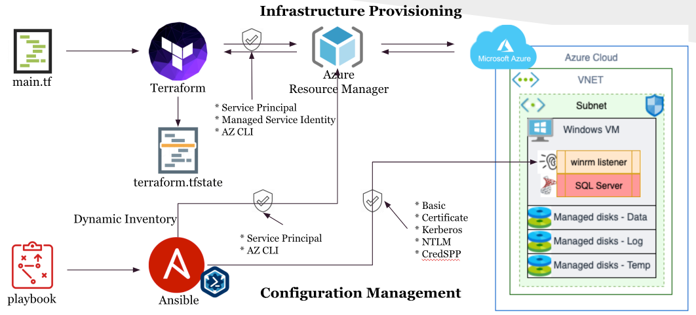

# azure-terraform-modules
Terraform modules for Azure.

## Components

### [BasicNetwork](./components/BasicNetwork/README.md)
Create Basic Network Resources
* Vnet
* Subnet
* NSG
* Route table

### [Event Hub Shared](./components/EventHubShared/README.md)
Create below resources. Its recommended to create one consumer group per application / system that should process events.
* Event Hub Namespace
* Event Hub
* Consumer group
* Keys(authorization rules)
* Azure monitor diagnostic setting
* Private endpoint

### [Machine Learning Workspace](./components/MachineLearningWorkspace/README.md)
Create below resources and apply security best practices.
* Storage account
* Key vault
* Container registry
* Application insights
* machine learning workspace
* computeInstances - using powershell since Terraform doesn't support this yet.
* computeClusters - using powershell since Terraform doesn't support this yet.

### [SQL Server on Windows VM](./components/SqlServerWindowsVm/README.md)
SQL Server on Windows VM is provision by the below workflow.

* Terraform
    * Create VNET, Subnets, and NSGs
    * Create a VM
    * Create managed disks
    * Enable WINRM
* Call Ansible + DSC from Terraform
    * Create storage space to provide better throughput and IOPS.
    * Install SQL Server.

### [Synapse Workspace](./components/SynapseWorkspace/README.md)
Create below resources.
* Storage account
* Synapse workspace
* Synapse role assignment
* Dedicated SQL Pool
* Private endpoint