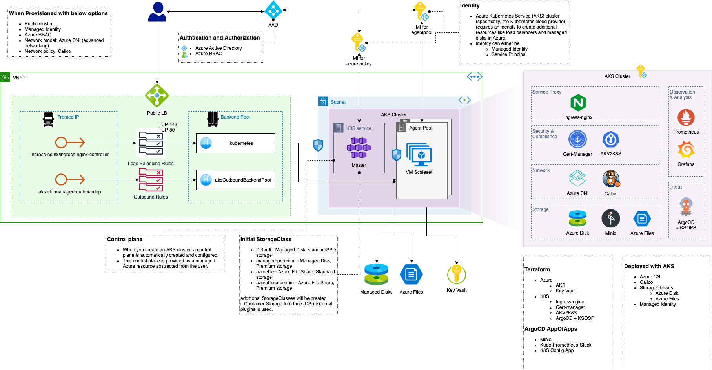

# StandardAKS
Terraform modules to provision AKS and bootstrap using ArgoCD AppOfApps pattern.

## Base Code
* [Azure/terraform-azurerm-aks](https://github.com/Azure/terraform-azurerm-aks)
* [avinor/terraform-azurerm-kubernetes](https://github.com/avinor/terraform-azurerm-kubernetes)
* [patuzov/terraform-private-aks](https://github.com/patuzov/terraform-private-aks)


## Diagram
This is what you will be getting.



* Terraform
    * Create VNET, Subnets, and NSGs.
    * Create a AKS cluster.
      * NSG for Agent Pool
      * Load balancer
      * Public IP address * 2
      * Managed Identity
      * Networking
        * Azure CNI
        * Calico
      * StorageClass
        * Managed Disk
        * Azure File
    * Create a storage account.
    * Create a key vault.
    * Deploy K8S resources.
      * Ingress-nginx - Ingress controller.
      * Cert-manager - Certificate management.
      * AKV2K8S - Manage secret using Azure Key Vault.
      * ArgoCD + KSOPS - Continuous delivery, Secret management using SOPS.
        * AKS bootstrap app
* ArgoCD Bootstrap APP Using [kulmam92/aks-argocd-bootstrap](https://github.com/kulmam92/aks-argocd-bootstrap)
    * Minio - Expose Azure storage as S3 compatible storage.
    * Kube-Prometheus-Stack - Monitoring.
    * K8S config App - Any K8S cluster level config.

## Usage
Example showing deployment of Bootstrapped AKS.

Sample script to deploy is in `/test/fixture`.

Make sure to replace any thing that starts with "<My-" from the `./test/fixture/terraform.tfvars` file before use that.

```terraform
component          = "AKSTest"
product            = "AKSTest"
environment        = "Sandbox"
datacenter         = "WestUS2"
location           = "WestUS2"
account_short_name = "aks"
tags = {
  DataCenter    = "WestUS2"
  Environment   = "Sandbox"
  Terraform     = true
  TerraformPath = "components/StandardAKS/test"
}
#################################
# Vnet
vnet_networking_object = {
  vnet = {
    name_overwrite  = null
    address_space   = ["10.1.0.0/16"]
    dns             = []
    enable_ddos_std = false
    ddos_id         = null
  }
  subnets = {
    subnet1 = {
      name_postfix                                   = "K8S"
      cidr                                           = ["10.1.0.0/22"]
      service_endpoints                              = ["Microsoft.Sql", "Microsoft.Storage", "Microsoft.KeyVault"]
      enforce_private_link_endpoint_network_policies = null
      enforce_private_link_service_network_policies  = null
      nsg_name_postfix                               = "K8S"
      nsg = [
        # ssh
        {
          name                       = "Allow-ssh"
          priority                   = 102
          direction                  = "Inbound"
          access                     = "Allow"
          protocol                   = "Tcp"
          source_port_range          = "*"
          destination_port_range     = "22"
          source_address_prefix      = "<My-IP-Address>"
          destination_address_prefix = "*"
        },
        # HTTPS
        {
          name                       = "Allow-HTTPS"
          priority                   = 103
          direction                  = "Inbound"
          access                     = "Allow"
          protocol                   = "*"
          source_port_range          = "*"
          destination_port_range     = "443"
          source_address_prefix      = "*"
          destination_address_prefix = "*"
        },
        # HTTP
        {
          name                       = "Allow-HTTP"
          priority                   = 104
          direction                  = "Inbound"
          access                     = "Allow"
          protocol                   = "*"
          source_port_range          = "*"
          destination_port_range     = "80"
          source_address_prefix      = "*"
          destination_address_prefix = "*"
        }
      ]
      delegation = null
      # # subnet delegation for aci_connector_linux
      # delegation = {
      #   name = "aciDelegation"
      #   service_delegation = {
      #     name    = "Microsoft.ContainerInstance/containerGroups"
      #     actions = ["Microsoft.Network/virtualNetworks/subnets/action"]
      #   }
      # }
    }
  }
}
#################################
# AKS cluster
aks_private_cluster_enabled = false
aks_dns_prefix              = "ldaks"
aks_sku_tier                = "Paid" # Paid/Free
# aks_kubernetes_version               = "1.18.10" # 1.9.3
aks_api_server_authorized_ip_ranges = ["<My-IP-Address>"]
# aks_node_resource_group              = null
aks_linux_profile     = { username = "aksadmin", ssh_key = "" }
aks_windows_profile   = { username = "aksadmin", password = "<My-password>" }
aks_service_principal = null # cluster infrastructure authentication - identity
aks_addons = {
  http_application_routing        = false
  dashboard                       = true
  oms_agent                       = false
  oms_agent_workspace_id          = null
  aci_connector_linux             = false
  aci_connector_linux_subnet_name = null
  policy                          = true
}
aks_network_profile = {
  network_plugin = "azure"        # kubenet
  network_policy = "calico"       # azure
  outbound_type  = "loadBalancer" # userDefinedRouting
  pod_cidr       = null           # network_plugin is set to kubenet.
  # This range should not be used by any network element on or connected to this VNet.
  # Service address CIDR must be smaller than /12.
  # docker_bridge_cidr, dns_service_ip and service_cidr should all be empty or all should be set.
  docker_bridge_cidr = null # IP address (in CIDR notation) used as the Docker bridge IP address on nodes.
  service_cidr       = null # The Network Range used by the Kubernetes service.
  dns_service_ip     = null # cidrhost(var.service_cidr, 10) IP address within the Kubernetes service address range that will be used by cluster service discovery (kube-dns).
}
#################################
# cluster node pool
aks_agent_pools = [
  {
    name = "linux"
    # node_count          = 1 # reuqired when enable_auto_scaling = flase
    vm_size = "Standard_D2_v3"
    # os_disk_size_gb     = each.value.os_disk_size_gb
    os_type             = "Linux"
    availability_zones  = [1, 2, 3]
    enable_auto_scaling = true
    min_count           = 1 # reuqired when enable_auto_scaling = true
    max_count           = 6 # reuqired when enable_auto_scaling = true
  }
]
# Will be set from the main.tf
# aks_agent_pool_subnet_name           = module.vnet.vnet_subnet_names[0]
# aks_agent_pool_vnet_name             = module.vnet.vnet_name
# aks_agent_pool_vnet_resource_group_name  = module.resource_group.name
#################################
# RBAC
aks_enable_role_based_access_control = true
aks_rbac_aad_managed                 = true
aks_rbac_aad_admin_group_names       = ["<My-ADD-Admin-Group>"]
# aks_rbac_azure_active_directory      = # don't set when rbac_aad_managed = true
#################################
# log analytics
aks_enable_log_analytics_workspace = true
aks_log_analytics_workspace_sku    = "free" # "PerGB2018"
aks_log_retention_in_days          = 7      # 30
#################################
# diagnostics
# aks_diagnostics = {
#   destination = string
#   eventhub_name = string
#   logs = ["all"]
#   metrics = ["all"]
# }
#################################
# role
# aks_container_registries             = var.container_registries
# aks_storage_contributor              = var.storage_contributor
# aks_managed_identities               = var.managed_identities
#################################
# Configure cluster
# "ServiceAccount", "User", "Group"
aks_admins = [
  { kind = "User", name = "<My-email>" },
  { kind = "Group", name = "<My-AD-group-admin-email>" }
]
# aks_service_accounts                 = # List of service accounts to create and their roles
#################################
# Run "htpasswd -c auth admin" to generate auth
# username should be admin. KubernetesIsCool is password in this example
aks_prometheus_basic_auth = "admin:$apr1$8spKbCh4$2b8tAg9lWYiy8XtNF6hqb/"
aks_cert_manager_acme_email = "<My-email>"

#################################
# storage account
# storage_account_name_override    = "saazusew2minio01"
storage_account_tier             = "Standard"
storage_account_replication_type = "LRS"
storage_account_kind             = "StorageV2"
storage_account_is_hns_enabled   = "true"
# only lowercase alphanumeric characters and hyphens allowed
storage_account_shares = [
  { name = "airflow-dags", quota = 10 },
  { name = "airflow-logs", quota = 10 }
]

#################################
# key vault
key_vault_sku_name = "premium"
key_vault_enable_rbac_authorization = true
key_vault_network_acls_ip_rules = ["<My-IP-Address>"]
key_vault_role_assignments = [
  {
    name = "<My-email>"
    role = "Key Vault Administrator"
    type = "user"
  },
  {
    name = "<My-AD-admin-group>"
    role = "Key Vault Administrator"
    type = "group"
  },
  {
    name = "<My-email>"
    role = "Key Vault Secrets Officer"
    type = "user"
  },
  {
    name = "<My-AD-admin-group>"
    role = "Key Vault Secrets Officer"
    type = "group"
  },
]
```