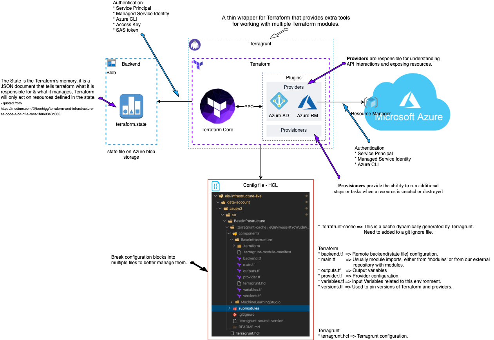

# Docker-Iac-Development
Docker file for Terraform and Ansible Development.

## Installed Components
* Powershell
* Az CLI
* Azure Powershell
* Terraform
* Terragrunt
* TFlint
* Ansible

## How to start

### Build
```
docker build --no-cache --rm -t iacbase:latest .
```

### Start
Run below
```
docker run -it -w /home/iacdev --rm --volume ""$PSScriptRoot/../":/home/iacdev/module" iacbase
```
or Powershell command
```
./start-azurecontainer.ps1
```

### start powershell session
```
[iacdev@52a67403aea5 ~]$ pwsh
PowerShell 7.0.3
Copyright (c) Microsoft Corporation. All rights reserved.

https://aka.ms/powershell
Type 'help' to get help.

PS /home/iacdev>
```

## How to Authenticate
There are multiple ways to authenticate Azure from Terrafrom. Below Terraform architecture diagram may help you to understand how Terraform is working.


### Authenticate Using AZ CLI

#### Connect Azure
```
PS /home/iacdev> PS /home/iacdev> az login
To sign in, use a web browser to open the page https://microsoft.com/devicelogin and enter the code XXXXXXXX to authenticate.
The following tenants don't contain accessible subscriptions. Use 'az login --allow-no-subscriptions' to have tenant level access.
XXXXX-XXXX-XXXX-XXXX-XXXXXXX
[
  {
    "cloudName": "AzureCloud",
    "homeTenantId": "XXXXX-XXXX-XXXX-XXXX-XXXXXXX",
    "id": "XXXXX-XXXX-XXXX-XXXX-XXXXXXX",
    "isDefault": true,
    "managedByTenants": [],
    "name": "my-subscription",
    "state": "Enabled",
    "tenantId": "XXXXX-XXXX-XXXX-XXXX-XXXXXXX",
    "user": {
      "name": "example@gmail.com",
      "type": "user"
    }
  }
]
PS /home/iacdev> 
```

### Authenticate Using Service Principal

#### Create SPN and Key Vault
This is a one time setting to do the followings.
* Create Service Principal
* Create Key Vault
* Add environment variables for Terraform
    * 'ARM-SUBSCRIPTION-ID' = $subscription.Id
    * 'ARM-CLIENT-ID'       = $terraformSP.ApplicationId
    * 'ARM-CLIENT-SECRET'   = $servicePrinciplePassword
    * 'ARM-TENANT-ID'       = $subscription.TenantId
    * 'ARM-ACCESS-KEY'      = $storageAccessKey
I'm using the script from [adamrushuk/terraform-azure](https://github.com/adamrushuk)
```
Connect-AzAccount -UseDeviceAuthentication
.\ConfigureAzureForSecureTerraformAccess.ps1 -adminUserDisplayName 'IAC Admin'
```

#### Connect Azure
```
PS /home/iacdev> cd /module/docker

PS /home/iacdev/module/docker> connect-azaccount -devicecode
WARNING: To sign in, use a web browser to open the page https://microsoft.com/devicelogin and enter the code EVQ2N9T3X to authenticate.
WARNING: TenantId 'XXXXX-XXXX-XXXX-XXXX-XXXXXXX' contains more than one active subscription. First one will be selected for further use. To select another subscription, use Set-AzContext.

Account           SubscriptionName           TenantId                             Environment
-------           ----------------           --------                             -----------
example@gmail.com my-subscription            XXXXX-XXXX-XXXX-XXXX-XXXXXXX         AzureCloud
```

#### Connect Azure
```
PS /home/iacdev/module/docker> ./LoadAzureTerraformSecretsToEnvVars.ps1 "terraform-kv" "XXXXX-XXXX-XXXX-XXXX-XXXXXXX"

PS /home/iacdev/module/docker> echo $env:ARM_CLIENT_ID
XXXXXXX-XXXX-XXXX-XXXXXXXXXX
```